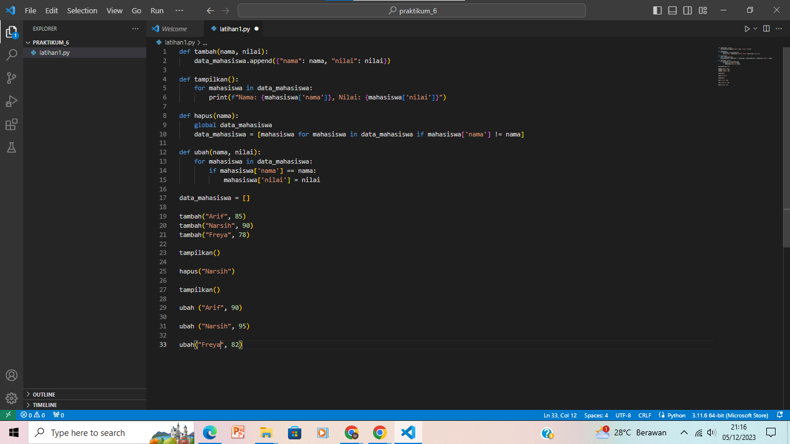
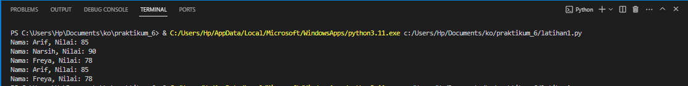

| variabel | Data Diri             |
| -------- | --------------------- |
| Nama     | Muhamad Arif Mulyanto |
| Kelas    | TI.23.A.5             |
| NIM      | 312310359             |

## PRAKTIKUM6
Subrutin:
- Subrutin adalah bagian kecil dari program yang dapat dipanggil untuk melakukan tugas tertentu.
- Digunakan untuk mengorganisir dan memecah program menjadi bagian-bagian yang lebih kecil dan mudah dikelola.
- Biasanya dipanggil dari bagian utama program (main program) dan dapat mengembalikan hasil ke pemanggilnya.
- Meningkatkan keterbacaan dan perawatan program.
Fungsi:
- Fungsi adalah blok kode yang dirancang untuk melakukan tugas tertentu dan dapat dipanggil dari bagian manapun dalam program.
- Sama seperti subrutin, fungsi membantu dalam memecah program menjadi bagian-bagian yang lebih kecil dan terorganisir.
- Fungsi dapat mengembalikan nilai kepada pemanggilnya.
- Meningkatkan modularitas dan reusabilitas kode
## Description
- tambah(): Fungsi ini digunakan untuk menambahkan data mahasiswa baru ke dalam daftar. Fungsi ini menerima dua argumen, yaitu nama dan nilai mahasiswa.
- tampilkan(): Fungsi ini digunakan untuk menampilkan data mahasiswa yang ada di dalam daftar. Fungsi ini menggunakan loop for untuk iterasi setiap elemen di dalam daftar.
- hapus(): Fungsi ini digunakan untuk menghapus data mahasiswa dari daftar. Fungsi ini menerima satu argumen, yaitu nama mahasiswa.
- ubah(): Fungsi ini digunakan untuk mengubah nilai mahasiswa di dalam daftar. Fungsi ini menerima dua argumen, yaitu nama dan nilai mahasiswa.
## INPUT

## OUTPUT

## features
1. Fungsi tambah(nama, nilai):
2. Menambahkan data mahasiswa baru ke dalam data_mahasiswa.
3. Fungsi tampilkan():
3. Menampilkan nama dan nilai mahasiswa yang ada dalam data_mahasiswa.
4. Fungsi hapus(nama):Menghapus data mahasiswa berdasarkan nama dari data_mahasiswa.
5. Fungsi ubah(nama, nilai):Mengubah nilai mahasiswa berdasarkan nama dalam data_mahasiswa.
6. Variabel data_mahasiswa:Menyimpan daftar mahasiswa beserta nilai mereka.
7. Pemanggilan Fungsi:Menambahkan beberapa mahasiswa ke dalam data_mahasiswa menggunakan fungsi tambah.Menampilkan data mahasiswa menggunakan fungsi tampilkan.Menghapus        mahasiswa "Bob" menggunakan fungsi hapus.Menampilkan data mahasiswa kembali.Mengubah nilai mahasiswa "Charlie" menggunakan fungsi ubah.Menampilkan data mahasiswa            setelahperubahan.Penggunaan List Comprehension:Fungsi hapus menggunakan list comprehension untuk menghasilkan list baru tanpa data mahasiswa yang dihapus.
8. Penggunaan Global Keyword:Fungsi hapus menggunakan kata kunci global untuk memodifikasi variabel data_mahasiswa di luar fungsi.
